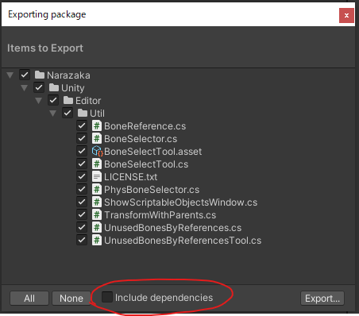

# VRChat用アセットを配布・販売する時に望ましい方法

私見です。

## 必ずチェックするべきこと

利用規約等に抵触したり不利益を被ったりする可能性があること

### 配布パッケージ(unitypackage)に再配布不可なアセットが含まれていないこと

Unityのエクスポート機能によってうっかり含まれてしまう場合がある罠。

- VRCSDKが含まれていない
- 他配布に無関係なアセットが含まれていない
  - 特にDynamicBone等有料アセットが含まれるとヤバい

対処法として一般的に

1. 配布したいフォルダを全て選択して「Export Package」する
2. 「Export Package」メニューで出るウインドウで **「Include dependencies（依存関係を含める）」のチェックを外す** 

などがあります。

しかし何回もエクスポートする場合いちいちチェックするのが面倒かも知れません。

[MizoresUnityPackageExporter](https://sleetcatshop.booth.pm/items/3504923) を使うとエクスポートするフォルダ等をあらかじめ指定しておいて、何度でも同じ設定でエクスポートできるので便利かもしれません。

## 強く推奨されること

できる限りしたほうがよいこと

### 適切に利用規約（ライセンス）を付けること

著作物（自分で作った3Dモデル・テクスチャ・絵・ソフトウェア等）は作者が特別に許可をしない限り原則他人が利用することはできません（参考: [著作権って何？（はじめての著作権講座 ）](https://www.cric.or.jp/qa/hajime/index.html) ただし「引用」等の例外はあります→[著作物が自由に使える場合 \| 文化庁](https://www.bunka.go.jp/seisaku/chosakuken/seidokaisetsu/gaiyo/chosakubutsu_jiyu.html)）。

そのため他人に利用されることを前提とした配布物には原則明示的な許可が必要で、「利用規約」を定めて許可範囲を明示することが推奨されます。

#### 利用規約とは

「利用規約」は **「見知らぬ他人に対して自動的に（つまり基本的に作者への連絡なしに）作品の利用許可をする文書」** です。

- いわば契約書的な文書で、最終的に争いになった際に裁判で参照されます。
- 「ここについては大丈夫」と文書で明文化されることにより、利用者が安心して配布物を使えます。
  - つまり利用規約が曖昧だと安心して利用できないからと利用を断念されることがあります。
- 逆に作者は本当にその許可文言で大丈夫であるかはきちんと吟味しないと、意に反した利用であっても利用を制限できなくなってしまう可能性があります。
  - つまり嫌なことをきちんと禁止すると書いておくことが重要です。
    - 思いつかないけどもしかして何かあるかも知れない的なものは「個別問い合わせ」にするのも良いです。
    - 嫌なことが起こっても利用規約では明示的に許可されている場合それについては作者の落ち度であるとされてしまう可能性があります。
  - よくある事例としては「性的・暴力的表現」等を許可していたが自分にとって不快なものが目に入ってしまう等。この場合その気持ち（特定の表現については禁止/自分が不快そうなものは見せないで/棲み分けを行って...等気持ちによって色々あると思います）まで書いておくのが良いです。
  - アバターモデルのいわゆる「首のすげ替え」は嫌だが利用規約にそれは禁止だと書いていないために騒動があったこともありました。この場合もそれら特定の行為を禁止する旨を記載しておくと良いです。
- 作品配布物を他人が使う場合にいちいち作者へ連絡し確認するのは面倒なため定めるものです。
  - 逆にDM等で個別確認で良いレベルの特定少数に配布する場合は都度その人に許可するみたいなのも良いかもしれません。

#### 利用規約の定め方

……というように利用規約はなかなか難しいものなので、法律に明るい人が作ったものを利用するのが推奨されます。

基本的にVRChatで利用される創作物には[VN3ライセンス](https://www.vn3.org/)がオススメです。
自分の気持ち的なものも含めてカスタマイズ可能でしっかりとした利用規約が作れます。

クリエイティブ・コモンズというものも利用されていますが、ややVRChatと食い合わせが悪いです。（利用の際には必ずクレジット表記が必要である等正しい利用方法が煩雑になるため）

無料配布のソフトウェア等にはオープンソースライセンスも選択肢に入ると思います。

また本当にあらゆることをされてもOKと言う場合はパブリックドメインという概念があり、[CC0](https://creativecommons.jp/sciencecommons/aboutcc0/)などがおすすめです。（本当にあらゆることなので注意して下さい）

#### 利用規約の付け方

購入しなくても利用規約が確認出来ることが重要です。

- 配布ページにライセンスを記載する
- 配布ページからライセンスPDF等へのリンクをはる
- Booth配布ページの無料商品としてライセンスPDF等を含める

などがおすすめです。

他人の著作物は利用規約に同意することによって初めて利用可能になるため、利用規約の確認が出来なければ同意しようがなく誰にも利用できないという話になってしまいます。

### 配布物の仕様を適切に表記すること

3Dモデルは特に別のモデルと組み合わせて使われることが多いため、他のモデルと互換性があるのかどうか記載することが重要です。

衣装等の場合

- 素体の体型調整BlendShapeに対応しているか（よくあるのは胸サイズ調整等 部分対応等も）
- 素体の揺れ物に対応しているか（同じく胸揺れ等）
- 素体の貫通防止BlendShapeを使用する想定か
- 素体にマスクテクスチャ等を付ける必要があるか

など素体との互換性や素体への変更を必要とするかは表記されていて欲しい情報です。

アバターモデルの場合素の状態でパフォーマンスランクがどのくらいかが分かると良いです。

- ポリゴン数やPBの数等

### サムネイルに凝ること・宣伝すること（広まって欲しい場合）

物は品質を上げれば売れるというものではありません。宣伝命です。

たくさん販売することを目標とするならサムネは絶対魅力の最大限伝わる物にしたほうがお得ですし、Twitter(X)等でもVRChatでもじゃんじゃん宣伝した方がお得です。

## おすすめできること

これがされていると喜ばれ、たぶん評判が良くなります。

### unitypackageを作ること

### 配布物のファイル名をユニークなものにすること

### アセット全体をフォルダに入れること

例えば以下のような感じだとインポートしたときにファイルが各所に散らばって整理が付かなくなってしまいます。

- `ワンピース.prefab`
- `Models/ワンピース.fbx`
- `Materials/tex.png`
- `Materials/ワンピース.mat`

少なくとも配布物を全て1フォルダにまとめて以下のようにするのがおすすめです。

- `かわいいワンピース/ワンピース.prefab`
- `かわいいワンピース/Models/ワンピース.fbx`
- `かわいいワンピース/Materials/tex.png`
- `かわいいワンピース/Materials/ワンピース.mat`

フォルダ分けについて下記のような色々な流派がありどれが使いやすいかは判断が分かれるところですが、他製品とかぶらないユニークな名前にすることをオススメします。（「ワンピース」ではなく「Narazakaのワンピース」や「Narazaka/ワンピース」などにする）

- `アセット名`
- `作者名/アセット名`
- `アバターのフォルダ/Costumes/衣装名`

### セットアップ済みPrefabを作ること

### Prefab Variantを活用すること

### PDFやclipファイルなどテクスチャの元ファイルを配布物に含めること

### 更新履歴やバージョンを付けること

## 余裕があったらやると良いこと

細かな心遣い。

### unitypackageとは別にFBXを含めること

### blendファイル等3Dモデルの元ファイルを配布物に含めること

### 試着アバター・試着ワールド・試供ワールドを作ること

### Modular Avatarを利用すること

### UVの工夫等利用者側で調整が難しい最適化を施しておくこと
